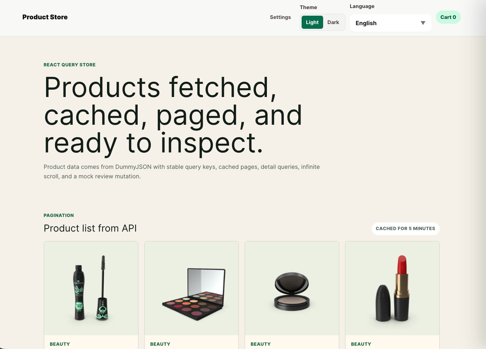
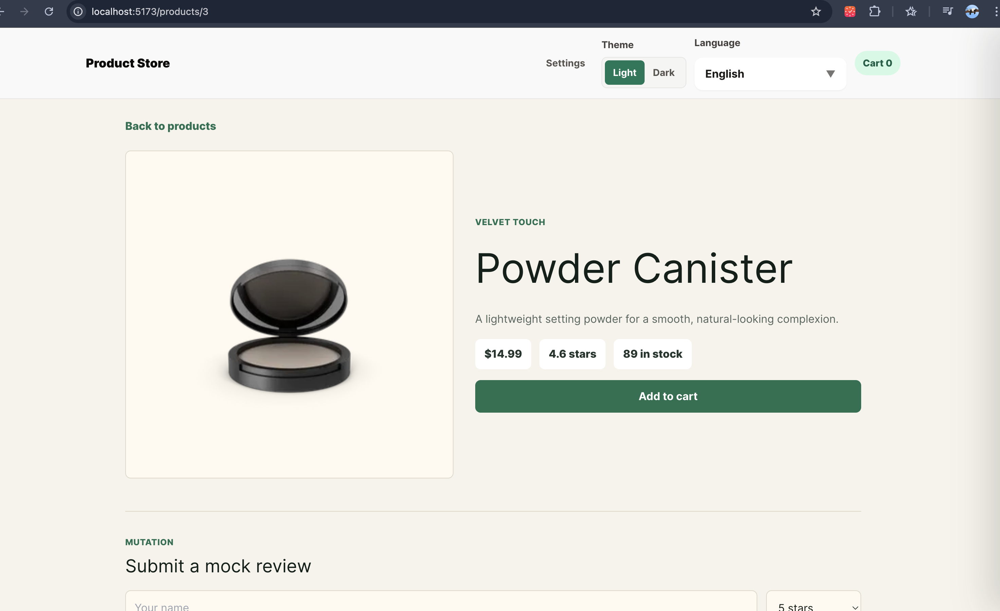
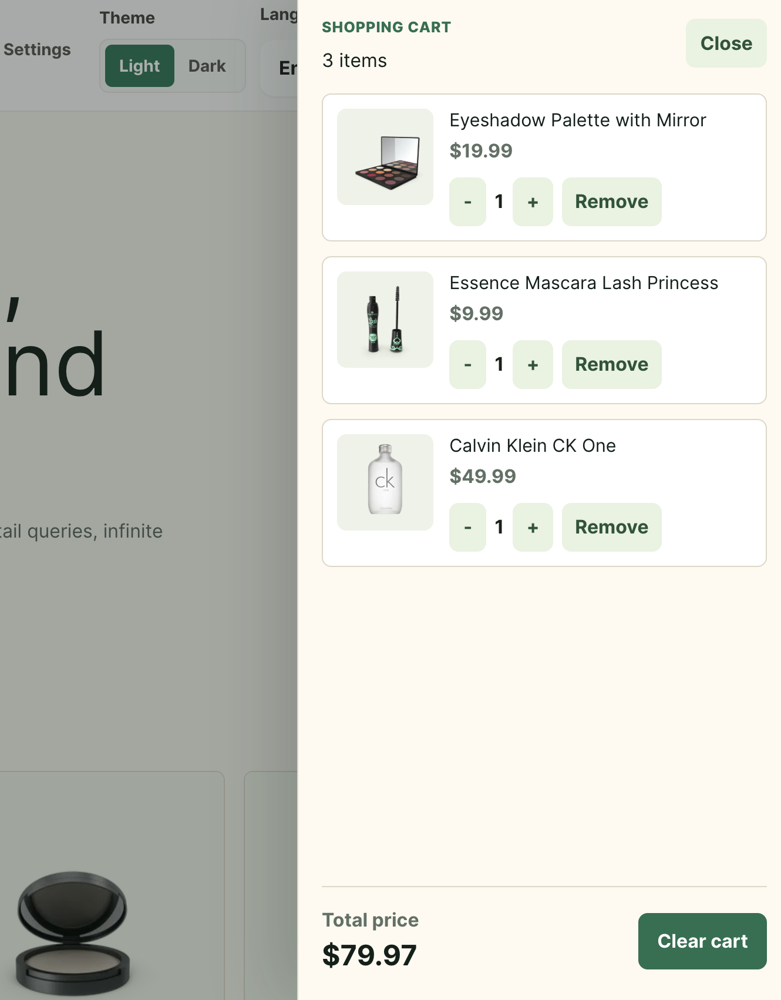
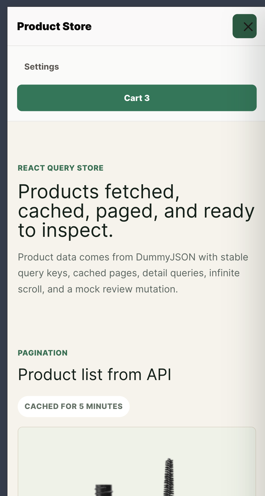

# Product Store App

A modern ecommerce product store built with React, Redux Toolkit, React Query, Context API, and Tailwind CSS.

The application allows users to browse products, view product details, manage a shopping cart, switch themes/languages, and experience a responsive modern UI.

# Live Demo

[View Live App](https://product-store-7r29.onrender.com)

# Features

* Product listing from external API
* Product details page
* Shopping cart with Redux Toolkit
* Add/remove cart items
* Increase/decrease product quantity
* Clear cart functionality
* Cart drawer UI
* Global app settings with Context API + useReducer
* Dark / Light theme switching
* Multi-language support (i18n)
* RTL / LTR layout support
* Responsive navigation bar
* Product localization support
* React Query data fetching
* Cached API requests
* Pagination
* Infinite scrolling
* Mock review mutation
* Responsive UI with Tailwind CSS
* Accessible UI controls
* Reusable preference controls
* Error handling
* Loading states

# Screenshots

## Home Page



---

## Product Details



---

## Cart Drawer



---

## Mobile View



# Tools & Libraries Used

* React
* Redux Toolkit
* React Redux
* React Query / TanStack Query
* React Router DOM
* Tailwind CSS
* React i18next
* React Hot Toast
* Vite

# Project Structure

```bash
src/
├── assets/images
├── components/
│
│   ├── cart/
│   │   └── CartDrawer.jsx
│   │
│   ├── layout/
│   │   ├── Footer.jsx
│   │   ├── Layout.jsx
│   │   └── Navbar.jsx
│   │
│   ├── settings/
│   │   ├── PreferenceControls.jsx
│   │   └── SettingsPanel.jsx
│   │
│   ├── ProductCard.jsx
│   └── ProductsList.jsx
│
├── context/
│   └── SettingsContext.jsx
│
├── features/
│   └── cart/
│       └── cartSlice.js
│   └── products/
│       └── productLocalization.js
│       └── productsApi.js
│       └── useProducts.js
├── locales/
│   ├── de/
│   ├── en/
│   ├── fa/
│   ├── ps/
│   ├── products/
│     └── de.json
│     └── en.json
│     └── fa.json
│     └── ps.json
│   ├── i18n.js
│   └── languages.js
│
├── pages/
│   ├── Home.jsx
│   ├── NotFound.jsx
│   ├── ProductDetails.jsx
│   └── Settings.jsx
│
├── App.css
├── App.jsx
├── index.css
└── main.jsx
```

---

# Getting Started

## 1. Clone the repository

```bash
git clone https://github.com/elhamatokhi/product-store.git
```

---

## 2. Install dependencies

```bash
npm install
```

---

## 3. Start development server

```bash
npm run dev
```
---

# API Used

* DummyJSON Products API

```txt
https://dummyjson.com/products
```

---

## 👤 Author

**Elhama Tokhi**

* GitHub: [https://github.com/elhamatokhi](https://github.com/elhamatokhi)
